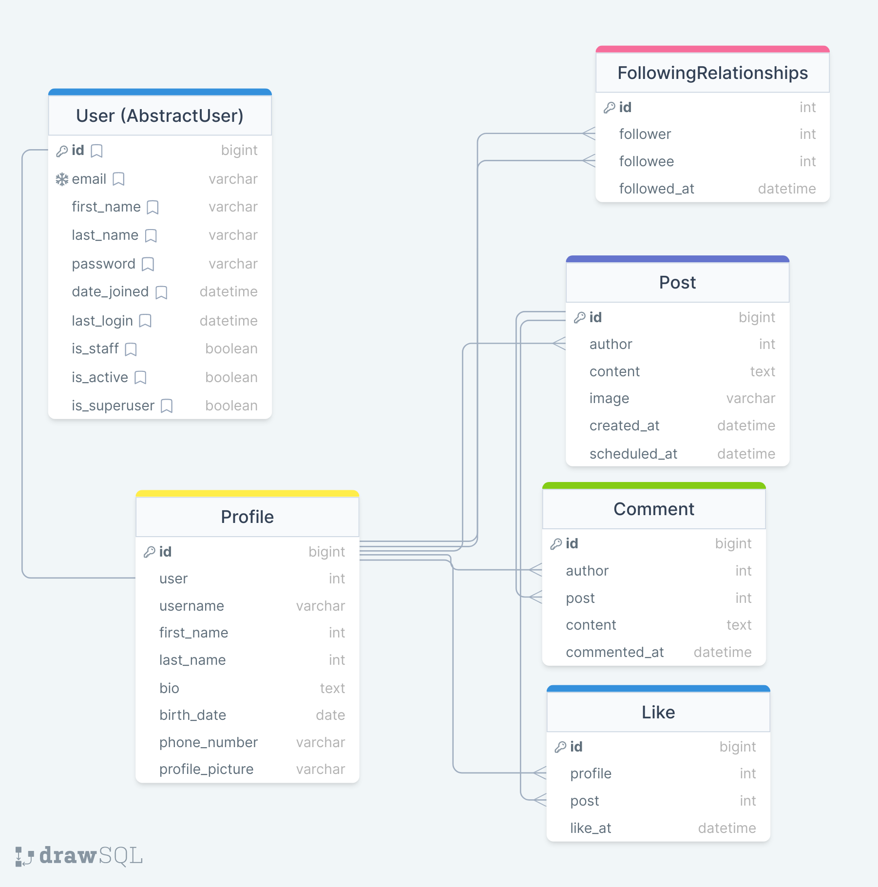

# **Social Media API**

> This repository contains a RESTful API built in Django and Django REST Framework for a social media platform. The API
> enables users to manage their profiles, follow other users, create and retrieve posts, manage likes and comments, and
> perform standard social media activities.
> Users authenticate with their email addresses and passwords, and the API uses token-based authentication to verify
requests.


# How to Use
```shell
# Clone the repository
git clone https://github.com/olenaliuby/social-media-api.git

# Create a virtual environment and activate it
python -m venv venv
source venv/bin/activate

# Install necessary packages
pip install -r requirements.txt

# Set up environmental variables
SECRET_KEY = SECRET_KEY
CELERY_BROKER_URL = CELERY_BROKER_URL
CELERY_RESULT_BACKEND = CELERY_RESULT_BACKEND

# Apply migrations and start the server
python manage.py migrate
python manage.py runserver

# Load initial data
python manage.py loaddata social_media_info_for_db.json

# Run Celery to enable scheduled posts
celery -A social_media_api worker -l info

# Register a user and retrieve a token by user endpoints to test the API
```


## **Features**

* **User Profile Management**: Users can create, retrieve, and update their profiles, including profile pictures, bios,
and other details. The API also provides endpoints to search for users based on usernames and other criteria.

* **Follow/Unfollow**: Users can follow and unfollow other users, and retrieve lists of their followers and those they are
following.

*  **Post Creation and Management**: Users can create, retrieve, and update their posts, with text content and optional
media attachments (images as an optional feature). The API provides ways to retrieve posts by a range of criteria
including hashtags and authorship by followed users.

* **Interactions**: Users can like/unlike posts, retrieve posts they have liked, and add comments to posts.

* **User Registration and Authentication**: Users register with their email and passwords and receive a token upon login
for subsequent authentication. The API also includes a logout function.

* **Scheduled Post Creation**: Using Celery, users can schedule posts to be created at specific times.

* **API Permissions**: The API uses Django's authentication and permission classes to ensure security and confidentiality.
Only authenticated users can perform actions like creating posts, liking posts, and following/unfollowing others.

* **API Documentation**: All the endpoints are well-documented by DRF Spectacular with clear instructions and examples for use.

## **Database Schema**

